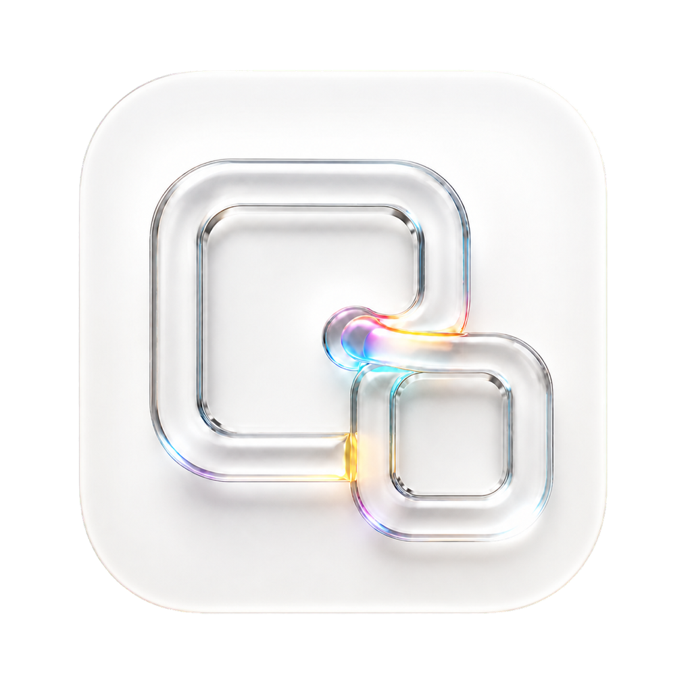
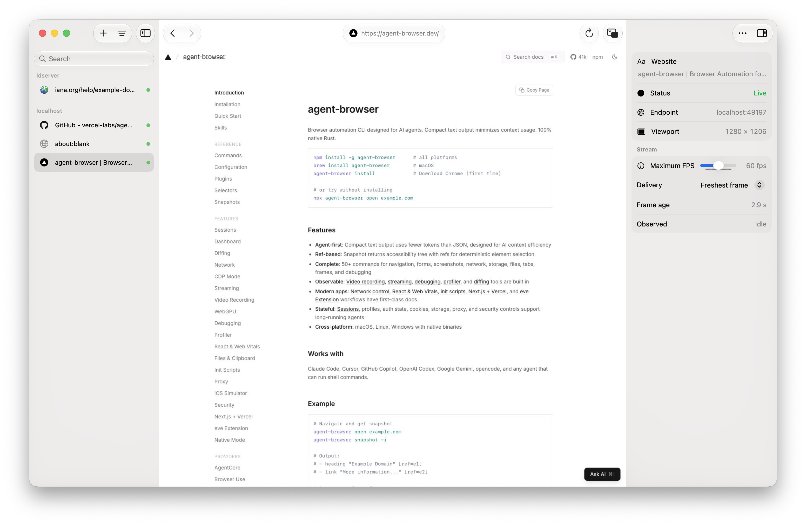

<p align="center">
  
</p>

<h1 align="center">Agent Browser Companion</h1>

<p align="center">
  <strong>Watch your cloud agents browse, then take over when they need a human.</strong>
</p>

<p align="center">
  <a href="../../releases/latest"><strong>Download the latest release</strong></a>
  ·
  <a href="#build-from-source">Build from source</a>
  ·
  <a href="#remote-sessions-over-ssh">SSH setup</a>
</p>

<p align="center">
  
  
  <a href="LICENSE"></a>
</p>

<p align="center">
  <picture>
    <source media="(prefers-color-scheme: dark)" srcset="Media/AgentBrowserCompanion-Hero-Dark.png">
    <source media="(prefers-color-scheme: light)" srcset="Media/AgentBrowserCompanion-Hero.png">
    
  </picture>
</p>

Agent Browser Companion is a fully native SwiftUI app for observing browser sessions operated by AI agents in cloud machines, development sandboxes, and remote servers. It gives you a live view of what the agent is doing without requiring you to keep the browser on your own Mac.

Its primary use case is human handoff. An agent can navigate and complete routine browser work independently, then hand control to you when a site requires something only you should provide: signing in, completing multi-factor authentication, solving a verification challenge, granting consent, or reviewing a sensitive action. You interact with the same live browser session, then hand it back to the agent to continue—without sending credentials in the agent conversation or restarting the task in a separate browser.

The app discovers active [Agent Browser](https://github.com/vercel-labs/agent-browser) sessions, streams their viewports into a Metal-backed canvas, and sends mouse, trackpad, keyboard, and touch input back to the browser.

## Highlights

- **Human handoff** — directly take over a cloud or sandboxed agent's existing browser for login, MFA, verification, consent, and other human-only steps.
- **Observe agent work** — follow browser activity live while the agent works on another machine, then intervene only when needed.
- **Local and remote discovery** — find sessions on this Mac and previously connected SSH hosts in one place.
- **Tailscale-friendly** — connect through a MagicDNS hostname, Tailscale IP, or SSH config alias without exposing the browser stream publicly.
- **Multiple live browsers** — keep several sessions available and switch between them instantly.
- **Native controls** — Back, Forward, Reload, URL context, connection health, and stream settings use standard macOS components.
- **Picture in Picture** — detach one or more sessions into a floating, interactive card stack across Spaces and full-screen apps.
- **Low-latency rendering** — ImageIO frame decoding, acknowledgement pacing, and a Metal-backed `MTKView` keep interaction fluid.
- **Complete input forwarding** — mouse, scrolling, pinch, right-click, keyboard modifiers, text input, and multi-touch events.
- **Mac-first interface** — native sidebars, inspector, toolbars, materials, keyboard shortcuts, light/dark mode, and reduced-motion support.

## Requirements

- macOS 14 or later
- [Agent Browser](https://github.com/vercel-labs/agent-browser) installed on every Mac or SSH host you want to discover

Liquid Glass is available automatically on macOS 26. Earlier supported macOS releases use their native system appearance.

## Getting started

1. Start an Agent Browser session with streaming enabled:

   ```bash
   AGENT_BROWSER_STREAM_PORT=9223 agent-browser open https://example.com
   ```

2. Open Agent Browser Companion and press `⌘N`.
3. Choose the session under **Known Hosts**, then click **Add Session**.

The app remembers imported sessions, reconnects them on launch, and searches their SSH hosts automatically the next time you open Add Sessions.

## Remote sessions over SSH

Choose **Add Sessions → New SSH Host** and enter a hostname, `user@host`, or alias from `~/.ssh/config`. The app runs Agent Browser discovery through OpenSSH and creates a loopback-only tunnel for every imported stream.

Authentication stays with OpenSSH, your SSH agent, macOS Keychain, and `~/.ssh/config`; the app does not request or store server passwords. Put options such as `User`, `Port`, `IdentityFile`, and `ProxyJump` in your SSH config:

```sshconfig
Host browser-server
    HostName browser.example.com
    User developer
    IdentityFile ~/.ssh/id_ed25519
```

### Tailscale

Agent Browser Companion works over Tailscale. If `ssh your-host` works in Terminal using a MagicDNS hostname, Tailscale IP, or SSH config alias, enter that same value under **New SSH Host**. The app uses standard OpenSSH over the Tailscale route, so it does not require a Tailscale SDK or app-specific network configuration.

Other network paths that make SSH reachable work too, including a LAN, VPN, or another private overlay network.

> [!IMPORTANT]
> A browser stream accepts keyboard and pointer input. Treat it like remote-desktop access: keep the Agent Browser stream bound to loopback and expose it only through the app's SSH tunnel.

## How it works

Agent Browser Companion uses Agent Browser's streaming protocol rather than exposing raw Chrome DevTools Protocol as its primary connection:

- receives `frame` and `status` events over WebSocket;
- sends `config` with acknowledgement pacing and the selected frame-rate limit;
- acknowledges frames after the Metal command buffer completes;
- sends `input_mouse`, `input_keyboard`, and `input_touch` events;
- uses Agent Browser commands for discovery, runtime health, navigation, and viewport updates;
- ignores unknown ordered events so newer protocol additions do not break the stream.

Remote sessions use the same protocol through managed local SSH port forwards. Tunnels are recreated automatically when the app reconnects.

## Build from source

Building from source requires Xcode 27. Open `Package.swift` and run the `AgentBrowserCompanion` scheme, or create a launchable app bundle from Terminal:

```bash
./Scripts/build-app.sh
open "build/Agent Browser Companion.app"
```

Run the test suite with:

```bash
swift test
```

The packaging script verifies that Swift stamped the executable with the active macOS SDK, copies the icon and metadata, and signs local development bundles ad hoc. Set `CODE_SIGN_IDENTITY` to use an installed signing identity instead.

## License

Agent Browser Companion is available under the [MIT License](LICENSE).

Agent Browser Companion is an independent companion project and is not affiliated with Google or the Chromium project.
